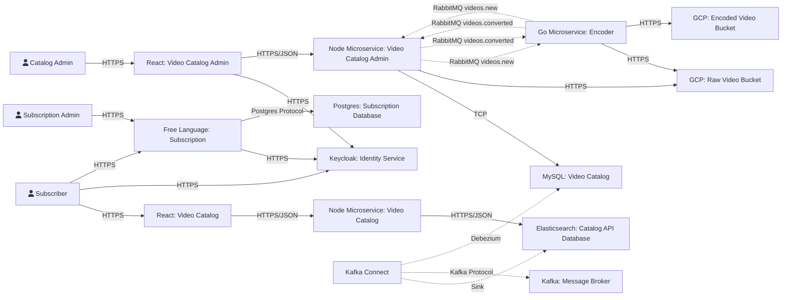

# [Codeflix] Microservice: Video Catalog Administration
Microservice developed to support the administration of video catalog of the hypotetical project called Codeflix.
## Technologies
This project was developed using the following technologies:
- [Node](https://nodejs.org/en/)
- [Nest](https://nestjs.com/)
- [Sequelize](https://sequelize.org/)
- [MySQL](https://www.mysql.com/)
- [Docker](https://www.docker.com/)
## Pre-requisites
To run this project locally, you must install the following tools in your development environment:
- [Docker](https://www.docker.com/)
- [Docker Compose](https://docs.docker.com/compose/)
## How to Run
To run this project, follow these steps:
1. Clone this repository
```bash
# Clone via ssh
❯ git clone git@github.com:ayrtonbsouza/codeflix-catalog-admin-microservice.git
# Or clone via HTTPS
❯ git clone https://github.com/ayrtonbsouza/codeflix-catalog-admin-microservice.git
```
2. Go to project folder
```bash
❯ cd codeflix-catalog-admin-microservice
```
3. Run docker compose file
```bash
❯ docker compose up -d
```
4. Wait until the project start and go to [localhost:9000/docs](localhost:9000/docs)
## Concepts
This project was developed using concepts found in the following references:
- [Domain Driven Design](https://www.amazon.com/Domain-Driven-Design-Tackling-Complexity-Software/dp/0321125215/ref=sr_1_1?keywords=domain+driven+design&qid=1659496893&s=books&sprefix=domain+dr%2Cstripbooks-intl-ship%2C215&sr=1-1)
- [Clean Code](https://www.amazon.com/Clean-Code-Handbook-Software-Craftsmanship/dp/0132350882)
- [Clean Architecture](https://www.amazon.com/Clean-Architecture-Craftsmans-Software-Structure/dp/0134494164/ref=sr_1_1?keywords=clean+architecture&qid=1659496918&s=books&sprefix=clean+archi%2Cstripbooks-intl-ship%2C181&sr=1-1)
- [Test Driven Development](https://www.amazon.com/Learning-Test-Driven-Development-Polyglot-Uncluttered/dp/1098106474/ref=sr_1_2?crid=KVDJAO2X3D08&keywords=test+driven+development+javascript&qid=1659496955&s=books&sprefix=test+driven+development+javascript%2Cstripbooks-intl-ship%2C163&sr=1-2)
## Architecture

